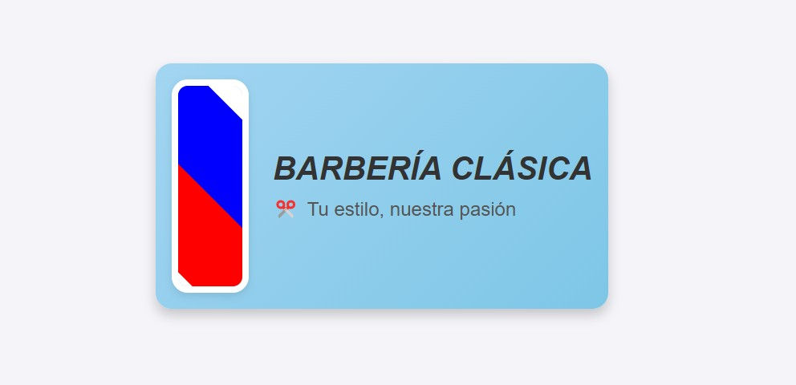

# Proyecto: Poste de Barbero Animado

## Descripción
Este proyecto consiste en una representación web de un poste de barbero clásico, animado y estilizado con colores tradicionales (blanco, rojo y azul). El diseño incluye un marco elegante alrededor del poste y un nombre de peluquería acompañado de un ícono de tijeras como logo. 

El fondo del contenedor tiene un degradado suave en tonos azules claros para dar un toque moderno y profesional. La animación del poste es continua, fluida y atractiva, lograda mediante CSS sin necesidad de JavaScript.

## Características principales:
- **Poste animado**: Diseño dinámico con rayas giratorias en colores tradicionales.
- **Diseño limpio**: Interfaz minimalista con un degradado azul claro como fondo.
- **Texto estilizado**: Nombre de la peluquería en cursiva, resaltando estilo y profesionalidad.
- **Logo integrado**: Uso de un emoji de tijeras para complementar el tema de barbería.
- **Responsive**: Adecuado para visualización en diferentes dispositivos gracias a su diseño flexible.

## Tecnologías utilizadas:
- **HTML5**: Estructura básica del proyecto.
- **CSS3**: Estilos, animaciones y diseño visual.
- **Gradientes y sombras**: Para realzar el aspecto visual del proyecto.
